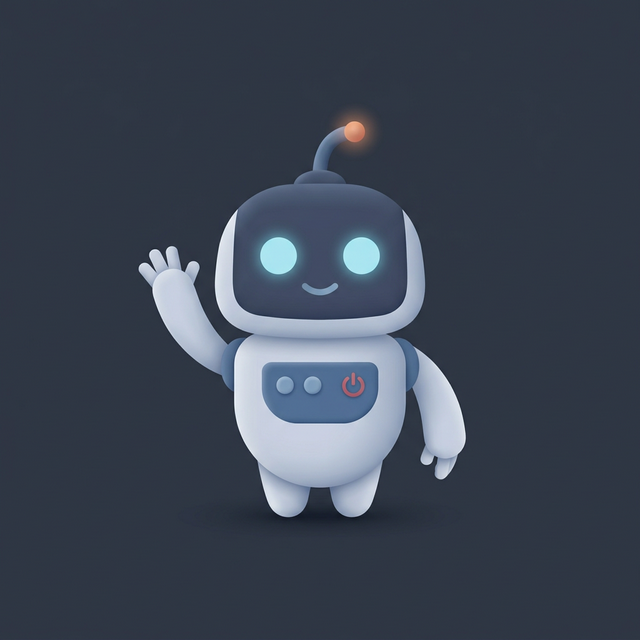

  

  
  
  

 

### 👨‍💻 A Bit About Me

I'm a **Software Engineer** specializing in **Rust** and backend development, bridging traditional infrastructure with Web3 systems. I care deeply about clean architecture, scalable microservices, and reliable performance.

- ⚙️ **Currently focused on:** Decentralized applications and robust backends.
- 🌱 **Deepening knowledge in:** Model Context Protocol (MCP) and distributed systems.
- 🤝 **Looking for:** Open-source collaborations, networking, and challenging backend engineering roles.
- 🧩 **Hobbies:** Chess, Piano, Logic Puzzles, and Competitive Programming (Advent of Code).

 

### 🛠️ Tech Stack & Tools

   
  <b>Languages</b>  
   
   <b>Backend & Databases</b>  
   
   <b>Infrastructure & Web3</b>  
  

 

### 🚀 Highlighted Projects

| 🦀 [RustLearn](https://github.com/petreleon/rust-learn) | 🤖 [Antigravity-Tutorial-Ro](https://github.com/petreleon/Google-Antigravity-Tutorial-Ro) | 🎵 [Pian-Psaltic](https://github.com/petreleon/Pian-Psaltic) |
| :--- | :--- | :--- |
| Decentralized E-Learning platform with crypto rewards. Built with **Rust (Actix-Web)** and **Solidity**. | Complete Romanian guide for Google Antigravity IDE, autonomous agents, and MCP workflows. | Web/Mobile assistant for Byzantine chant / Psaltic music, built with **TypeScript**. |

 

### 💼 Professional Journey

- **Freelance Software Engineer** @ *Leon Software* (Nov 2021 – Present)
- **Master's in Artificial Intelligence** @ *University of Craiova* (2021 – 2024)
- **Bachelor's in Automation** @ *University of Craiova* (2016 – 2021)
- **Web Developer Intern** @ *Caphyon* (Jul 2019 – Aug 2019)
- **Software Developer Intern** @ *Netrom* (Aug 2018 – Sep 2018)

 

---

  

<!--
**petreleon/petreleon** is a ✨ _special_ ✨ repository because its `README.md` (this file) appears on your GitHub profile.
-->
